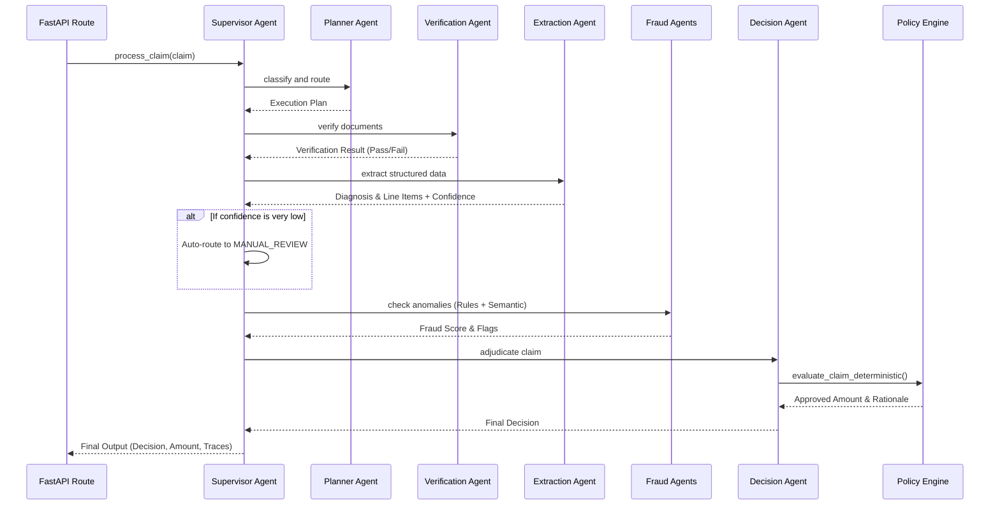
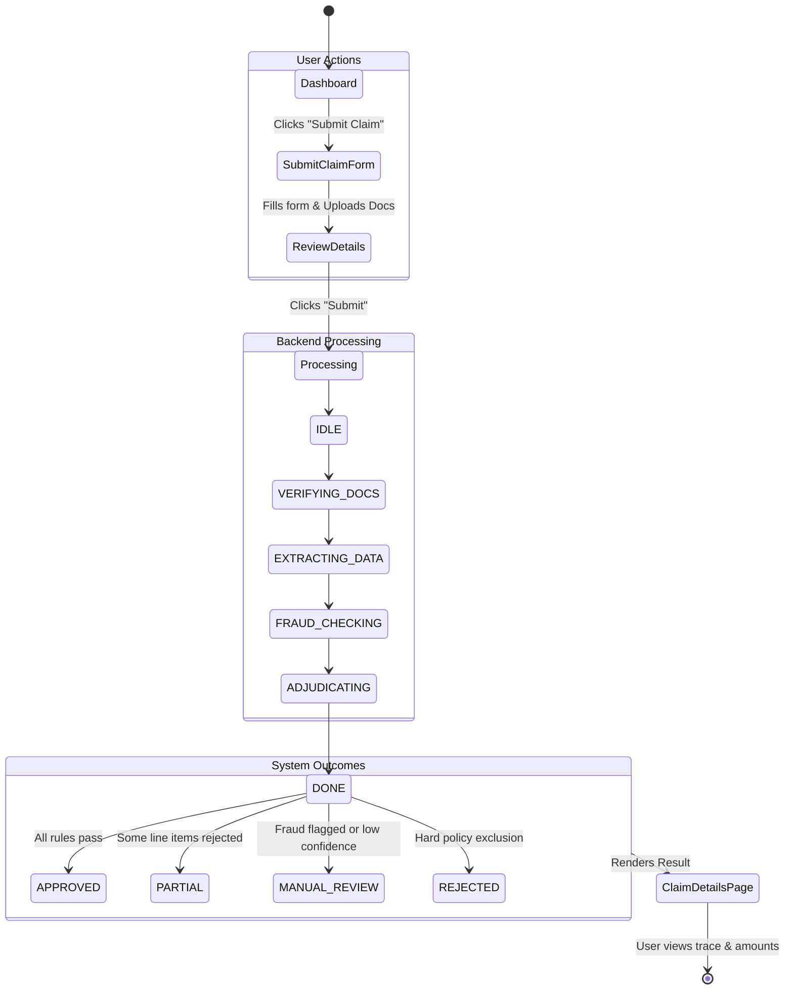

# Neural-Plum: System Architecture & User Flow

This document details the high-level architecture, multi-agent orchestration, and the end-to-end user flow of the Neural-Plum Claims Processing Engine.

---

## 1. High-Level Architecture

The system is designed with a clean separation between the frontend presentation layer, the backend API, the multi-agent orchestration layer, and the deterministic policy rules engine.

```mermaid
graph TD
    %% Frontend Layer
    subgraph Frontend [Frontend (React + Vite + Tailwind)]
        UI[User Interface]
        State[State Management]
    end

    %% Backend Layer
    subgraph Backend [Backend (FastAPI)]
        API[REST API /v1/claims]
        Auth[API Key Auth & CORS]
        
        %% Orchestration
        subgraph Orchestration [Multi-Agent Orchestration]
            Supervisor[Supervisor Agent]
            Agents[Sub-Agents: Planner, Verifier, Extractor, Fraud, Decision, Summary]
        end
        
        %% Core Logic
        subgraph Logic [Core Business Logic]
            PolicyEngine[Deterministic Policy Engine]
            PolicyConfig[JSON Policy Configuration]
        end
        
        %% Data Layer
        subgraph Data [Persistence]
            SQLite[(SQLite Database)]
            SQLAlchemy[SQLAlchemy ORM]
        end
        
        %% External Services
        subgraph External [External Services]
            LLM[Gemini / Anthropic LLM]
        end
    end

    %% Connections
    UI -->|HTTP POST| Auth
    Auth --> API
    API --> Supervisor
    Supervisor <--> Agents
    Agents -->|Extract Data| LLM
    Agents -->|Evaluate Rules| PolicyEngine
    PolicyEngine -->|Load Rules| PolicyConfig
    Supervisor -->|Persist Claims & Traces| SQLAlchemy
    SQLAlchemy --> SQLite
```

---

## 2. Multi-Agent Orchestration Pattern

The backend utilizes a **Supervisor-Subagent** architecture. The Supervisor controls the flow, calculates overall confidence, and enforces graceful degradation (if an agent fails, the pipeline continues with reduced confidence).



### Agent Responsibilities:
1. **Planner Agent:** Classifies the claim and dynamically decides which downstream agents need to run.
2. **Document Verification Agent:** Checks if required documents are present, readable, and if patient names match across documents.
3. **Document Extraction Agent:** Uses LLM (or mock fallbacks) to extract diagnosis, pre-authorization status, and line items. Estimates per-field confidence.
4. **Fraud Detector Agent:** Deterministic checks for threshold limits and velocity (e.g., multiple claims on the same day).
5. **Semantic Fraud Agent:** AI-powered advisory agent that checks for logical anomalies (e.g., claiming an MRI for a common cold).
6. **Decision Agent:** Passes structured data to the Policy Engine and formats the result.
7. **Case Summary Agent:** Generates a human-readable summary of the entire adjudication process.

---

## 3. End-to-End User Flow

The following describes the step-by-step experience of a member submitting a claim through the application.



### Step-by-Step Flow:

1. **Dashboard:** The user logs into the React frontend and views their active policy details and past claims.
2. **Initiate Submission:** The user clicks "Submit a Claim".
3. **Data Entry:** 
   - The user inputs their `Member ID`, `Claim Category` (e.g., Consultation, Pharmacy), and `Claimed Amount`.
   - The user uploads supporting documents (Prescriptions, Invoices, Lab Reports).
4. **Submission:** The frontend sends a `multipart/form-data` POST request to `/v1/claims` with the `X-API-Key` auth header.
5. **Backend Processing:** 
   - The API validates the inputs and invokes the Supervisor.
   - The system transitions through internal states (`VERIFYING` → `EXTRACTING` → `FRAUD_CHECKING` → `DECIDING`).
   - The Policy Engine strictly calculates network discounts, copays, and limits without LLM hallucination risk.
6. **Persistence:** The final decision, approved amount, rejection reasons, and a detailed step-by-step trace are saved to the SQLite database.
7. **Result Viewing:** The API responds with the claim ID, and the frontend automatically redirects the user to the `/claims/{id}` page.
8. **Transparency:** The user views a beautiful breakdown of their claim showing:
   - The final decision (Approved, Rejected, Partial, or Manual Review)
   - The approved amount vs. claimed amount
   - A timeline trace of exactly how the AI agents processed the claim.
